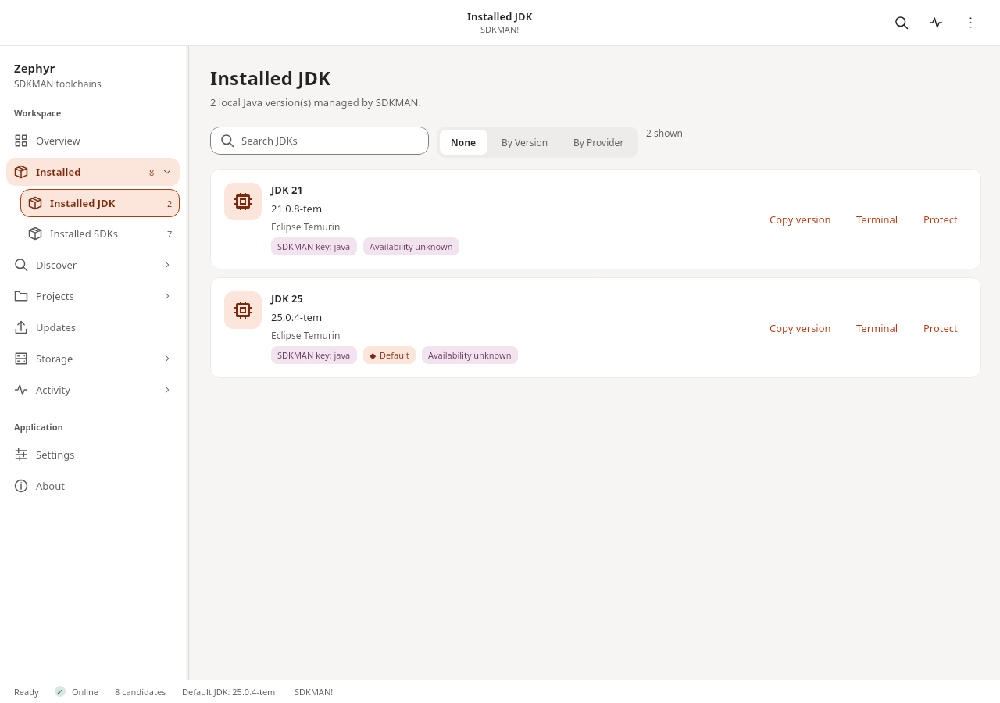
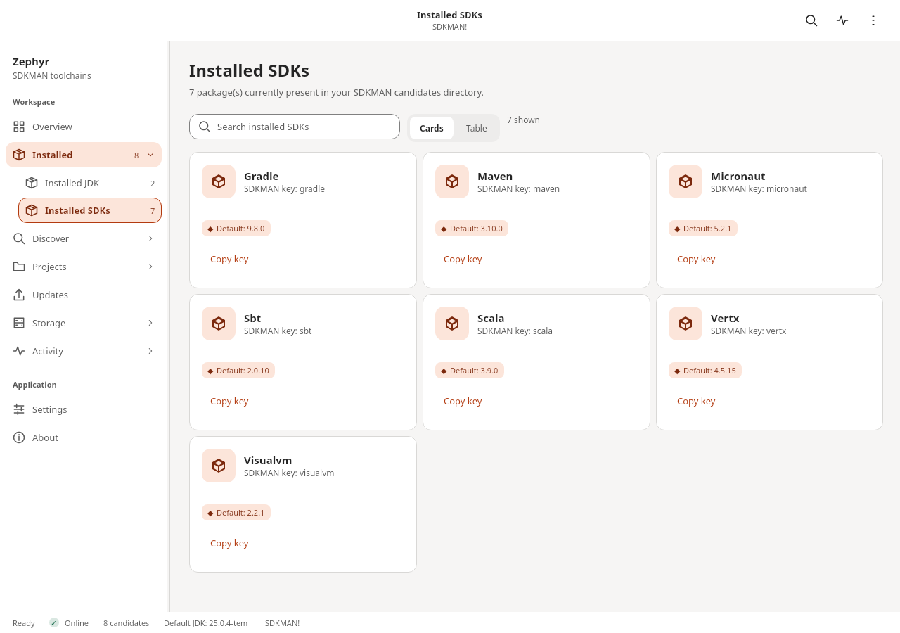
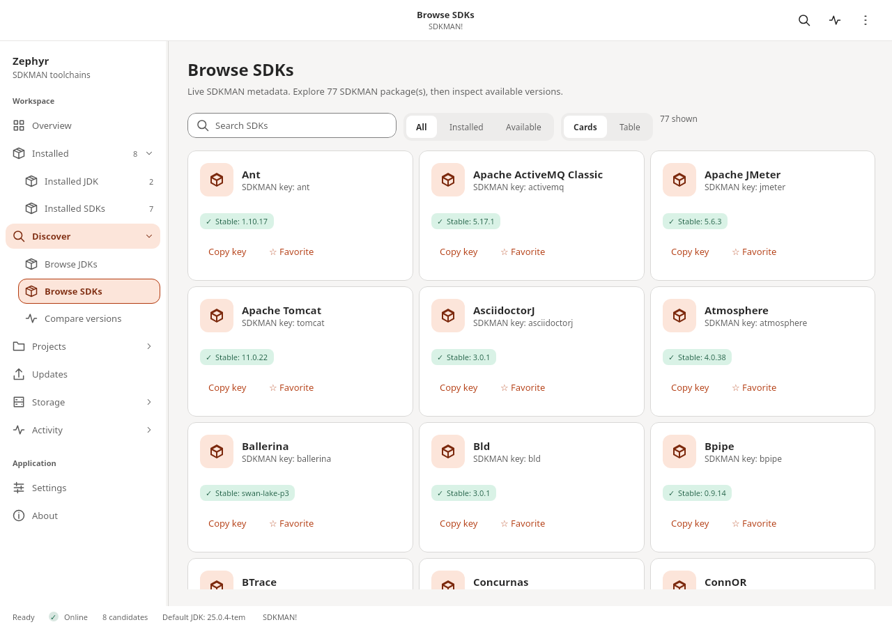

# Zephyr

A desktop GUI for [SDKMAN](https://sdkman.io/) built with Kotlin Multiplatform and Compose Desktop.
Zephyr wraps the SDKMAN CLI and local filesystem — it does not reimplement package management.

---

## Downloads

Linux releases provide AppImage, Snap, and Flatpak bundles for `amd64` and
`arm64`. Download the available artifacts and `SHA256SUMS` from
[GitHub Releases](https://github.com/w0rxbend/Zephyr/releases). Packaging,
local build commands, Snap Store prerequisites, and Flatpak/Flathub scope are
documented in [`DISTRIBUTION.md`](DISTRIBUTION.md).

---

## The Idea

SDKMAN is excellent for installing and switching JDKs and SDKs from the terminal. But over time it accumulates **local-only versions**: builds that are installed in `~/.sdkman/candidates/` but are no longer listed in SDKMAN's remote registry.

This happens when:

- A distribution vendor pulls a specific build from the catalog.
- A version identifier changes upstream (a patch release gets replaced).
- A provider is removed or renamed in SDKMAN.

These orphaned versions waste disk space, cannot be updated through `sdk upgrade`, and are only visible if you run `sdk list <candidate>` and scan the output for the `local only` marker — one candidate at a time.

**Zephyr's primary goal is to surface local-only versions across all installed candidates in one place and make cleanup safe and straightforward.**

---

## Terminology

Zephyr uses user-facing labels instead of SDKMAN's internal "candidate" term:

- The `java` candidate is always presented as **JDK**.
- All other candidates are presented as **SDKs**.
- Internal code keeps using `Candidate` because it maps directly to SDKMAN.
- Java version identifiers are shown as JDK versions: `JDK 25`, `JDK 21`, `JDK 17`.

---

## Current Functionality

### Workbench and navigation

- **Overview** — default JDK, installed-version totals, local-only risk, health checks, and quick actions.
- **Installed JDK** — locally installed Java versions.
- **Installed SDKs** — all other locally installed SDKMAN candidates.
- **Browse JDKs** — SDKMAN's remote Java catalog.
- **Browse SDKs** — all other remote SDKMAN candidates.
- **Local-Only Versions** — orphan review and an explicit rescan workflow.
- **Diagnostics** — SDKMAN installation, connectivity, integrity health, and redacted support-bundle export.
- **Operation History** — searchable session journal with timestamps, command fields, outcomes, and CSV export.
- **Settings** — persisted theme, information density, and SDKMAN-path privacy controls.
- **About** — application version, runtime integration, project links, and license.

Navigation is grouped into Workspace, Discover, Maintenance, and application sections. A compact toolbar exposes global maintenance actions, while the bottom status bar reports background work, candidate count, default JDK, and SDKMAN state.

### Global search

- Open search from the toolbar or press `Ctrl+K` on Windows/Linux and `Cmd+K` on macOS.
- Search workspace pages, installed and previously loaded catalog candidates, installed versions, settings, and maintenance actions from one field.
- Use Up/Down to select a result, Enter to open or run it, and Escape to close.
- SDKMAN mutations selected from search still use the same network preflight and typed transaction preview as their visible toolbar controls.

### Command palette

- Press `Ctrl+Shift+P` on Windows/Linux or `Cmd+Shift+P` on macOS for a command-only view.
- The palette searches workspace navigation and maintenance commands while excluding candidate and version results.
- Frequent commands also have direct shortcuts: `Ctrl/Cmd+Shift+R` refreshes local state, `Ctrl/Cmd+Shift+L` scans local-only versions, and `Ctrl/Cmd+Shift+D` opens Diagnostics.
- Command shortcuts route through the same ViewModel operations as visible controls, preserving busy-state and transaction safeguards.

### Keyboard navigation

- Tab and Shift+Tab move focus; Enter or Space activates the focused control. Custom sidebar and toolbar controls show a primary-color focus border.
- `Ctrl/Cmd+Shift+O` opens Overview, `J` opens Installed JDK, `S` opens Installed SDKs, `U` opens Update Center, `D` opens Diagnostics, and `H` opens Operation History.
- The full shortcut reference is available in Settings and in command-palette result hints.
- Global shortcut routing is tested independently from UI event delivery.

### Resizable navigation

- Drag the divider between the sidebar and page content to resize navigation.
- Width is constrained to 190–360 dp so labels remain usable and content cannot be crowded out.
- The chosen width persists for the desktop user; Settings shows the saved value and can reset it to the current density-aware default.

### Card and table views

- Installed SDKs and Browse SDKs each expose Cards/Table controls.
- Card mode keeps descriptions and visual scanning; table mode prioritizes dense identifiers, defaults, stable targets, favorites, and actions.
- Installed and catalog modes persist independently, so each page family keeps its preferred presentation.

### Sort and filters

- Browse JDKs combines free-text search with All/Installed/Available/Local-only status, an explicit vendor selector, and Catalog/Version/Vendor sorting.
- Active search, status, vendor, and sort choices render as visible badges with one **Clear filters** action.
- Filter and sort composition is covered by deterministic presentation tests.

### Saved filters

- Name and save any active Browse JDK query/status/vendor/sort combination.
- Saved presets persist locally, apply all fields together, and appear directly below the filter controls.
- Saving the same name replaces the previous preset; the adjacent × action removes a preset without changing SDKMAN data.

### Accessible status language

- Health, progress, warning, and error markers use distinct symbols in addition to color.
- Emphasized badges retain explicit text while pairing each tone with a consistent symbol.
- Status markers and badges publish descriptive accessibility labels for assistive technologies.

### Scalable typography

- Settings offers persisted 100%, 125%, 150%, 175%, and 200% text scales.
- Scaling is applied to the complete Material type system, including headings, body copy, labels, and dialogs.
- Navigation, toolbar, status bar, panel, and control metrics grow with text so larger labels are not clipped.

### Reduced motion

- The System motion setting honors the GNOME `enable-animations` desktop preference when available.
- Full and Reduced settings provide persisted explicit overrides.
- Reduced mode replaces all indeterminate spinning progress indicators with a static, semantically labeled progress marker.

### Guided empty states

- Empty pages explain what is missing and provide a context-specific primary action.
- Recovery paths include refreshing metadata, clearing filters, browsing candidates, choosing another file, capturing a profile, and selecting comparison rows.
- The shared empty-state layout keeps guidance centered and readable at larger text scales.

### Context menus

- Right-click installed candidates, catalog packages, JDK cards, or version rows to open actions at the pointer.
- Menus mirror visible inspect, copy, favorite, protect, install, make-default, uninstall, update, and cleanup controls when each action is safe.
- Mutating context actions call the same typed transactions and confirmation previews as their visible counterparts.

### Scheduled metadata refresh

- Settings provides opt-in Off, Hourly, Every 6 hours, and Daily SDKMAN metadata schedules.
- Scheduling runs only while Zephyr is open and skips refreshes when offline, busy, or waiting for transaction confirmation.
- The active cadence is shown in the bottom status bar; scheduled completion is reported through the normal outcome surface.

### Update notifications

- Settings provides Off, Updates only, and All checks desktop-notification policies.
- Any loaded catalog refresh can produce a notification without requiring the Browse or Update Center page to be open.
- Notices are deduplicated per update set, include only candidate names and target versions, and use `notify-send` when available.

### Operation notifications

- Settings provides Off, Long operations, and All completions policies for reviewed toolchain work.
- The default long-operation threshold is ten seconds, and each completed journal entry is notified at most once.
- Desktop text reports only status and reviewed step counts; command output and filesystem paths stay inside Zephyr.

### Safe read retry queue

- Failed installed-state, catalog, candidate-detail, and integrity reads retry twice with bounded backoff.
- The status bar shows the queued read and next attempt while retrying, then clears it on success or terminal failure.
- The retry API accepts only typed read operations; installs, default changes, removals, cleanup, metadata writes, and self-update execute once and remain user-controlled.

### Offline catalog cache

- Successful SDKMAN catalog loads persist a versioned metadata cache under the platform cache directory.
- Startup hydrates Browse from that cache before network access; offline refresh keeps cached results usable instead of replacing them with an empty error state.
- Browse headers and the status bar distinguish cached from live metadata and show a stable human-readable cache age.

### JDK vendor knowledge

- Browse JDK vendor filters expose curated maintainer, distribution, and support-characteristic context.
- The built-in knowledge set is versioned by review date, uses unique SDKMAN vendor codes, and attaches an authoritative HTTPS source to every entry.
- Support summaries are informational; linked vendor policies remain the authority for licensing and lifecycle decisions.

### Upstream release notes

- Known JDK distributions and SDK candidates expose **Release notes** directly in Update Center before install review.
- Version-specific links are used where upstreams publish stable URL patterns; otherwise Zephyr opens the official release history.
- Both registry resolution and the native browser boundary reject non-HTTPS, credential-bearing, malformed, whitespace, and control-character URLs.

### Enterprise proxy

- Settings accepts an explicit proxy hostname, port, and optional username for SDKMAN network commands.
- Proxy passwords are stored and retrieved only through Linux Secret Service via `secret-tool`; if it is unavailable, Zephyr refuses to persist the password.
- Credentials never enter app preferences or shell command text. They are URL-encoded and scoped to the SDKMAN child-process environment.
- Connectivity diagnostics use the same proxy environment as SDKMAN reads while keeping credentials out of the curl argument list.

### Custom SDKMAN home

- Settings can select a machine-specific SDKMAN home through the native directory chooser.
- Zephyr validates that `bin/sdkman-init.sh` is a regular file and `candidates/` is a directory before saving the normalized path.
- Clearing the override returns startup discovery to `SDKMAN_DIR` and then the standard user-home location; changes apply after restart.

### Portable preferences

- Settings exports and imports a deterministic, versioned `.zephyr-prefs` file with appearance, automation policy, favorites, recents, profiles, view modes, navigation width, and saved filters.
- Import updates only the portable allowlist and preserves machine-local cleanup observations.
- SDKMAN paths, proxy coordinates and credentials, caches, operation history, and other machine state do not exist in the portable model.

### Plugin-ready actions

- Command-palette operations dispatch through a versioned `ZephyrActionRequest` contract instead of exposing ViewModel or Compose state.
- Stable action IDs distinguish immediate reads from review-only operations; integrations cannot bypass typed transaction confirmation.
- Unknown versions, IDs, parameters, control characters, and oversized values are rejected. The compatibility policy is documented in [`ACTION_CONTRACT.md`](ACTION_CONTRACT.md).

### Accessibility quality gate

- Navigation, search results, accordions, buttons, segmented choices, status, and progress publish explicit interaction, selection, and state semantics.
- Automated tests enforce WCAG AA contrast for core light/dark text pairs, non-color status signals, reduced-motion semantics, keyboard actions, and 200% text scaling.
- The completed manual keyboard, screen-reader, zoom, motion, and release checklist is maintained in [`ACCESSIBILITY_AUDIT.md`](ACCESSIBILITY_AUDIT.md).

### Local-only cleanup grace

- Settings provides opt-in Off, 7-day, 30-day, and 90-day review thresholds.
- Zephyr persists the first time each candidate/version is observed as local-only and marks overdue counts on the Local-Only page.
- The policy never deletes automatically: cleanup still requires a user action, transaction preview, protection checks, and repository re-verification.

### Activated terminals

- Installed JDK and SDK versions expose a **Terminal** action and matching right-click entry.
- Zephyr opens a supported Linux terminal, sources SDKMAN, and runs `sdk use` only inside the launched child shell.
- SDKMAN home, candidate, and version values travel through child-process environment variables rather than interpolated shell text; persisted defaults remain unchanged.

### Environment snapshots

- The Environment Snapshot workspace captures every installed SDKMAN version and persisted default.
- Exports use a versioned, deterministic `.zephyr-snapshot` format with native save selection and explicit overwrite confirmation.
- A session baseline exposes stable candidate-level differences in defaults and added or removed versions.
- Imported snapshots produce a typed restore preview with missing installs ordered before default changes.
- Restore runs sequentially and retains per-step results; importing the same snapshot again recalculates a smaller plan from the versions and defaults already completed.

### Favorites

- Favorite any SDK from Browse SDKs; favorites sort before other matching catalog results.
- In Browse JDKs, open **Favorite vendors** to switch to provider grouping, then pin or unpin a vendor from its group header.
- Favorite SDKs and JDK vendors persist with the desktop preferences and appear as direct shortcuts on Overview.
- Favorites store SDKMAN candidate keys and JDK provider codes only; they do not store machine paths or remote content.

### Recent items

- Opening a candidate detail records it in a most-recently-used list on Overview.
- The list keeps six unique SDKMAN candidate keys, moves revisited items to the front, and persists between launches.
- Recent entries resolve to JDK or SDK detail routes using current local/catalog metadata, with a safe key-based fallback.

### Update Center

- Update Center compares every installed candidate with its stable SDKMAN catalog target.
- Missing stable targets and installed-but-inactive stable targets are grouped into JDK and SDK updates.
- Select all or individual updates, inspect candidate details, or review an install-and-activate plan.
- Missing targets install before becoming the persisted SDKMAN default; installed targets activate without a download.
- A failed install skips only its dependent default change while unrelated selected targets continue and remain journaled.
- Every update uses typed review, disk-impact estimation, confirmation, and journal history. Switch-only plans work offline; plans containing installs run the route-aware network preflight.
- Refreshing Update Center metadata is explicit and uses the same confirmed SDKMAN metadata transaction as the toolbar.

### Batch installs

- Select multiple Update Center targets and choose **Review selected** to create one typed batch plan.
- The preview lists every candidate/version command and combines available sibling-based disk estimates.
- Installs run strictly one at a time; a failed item does not prevent later selected items from running.
- Update Center shows pending, running, successful, failed, and skipped status per install/default command, while the status bar reports overall progress.
- The operation journal records the full batch command list and summary outcome.

### Batch uninstall

- Batch Uninstall lists every installed version but disables selection for persisted defaults and protected pins.
- Eligible versions can be selected across candidates and reviewed in one destructive typed transaction.
- The preview lists every removal and calculates the exact combined reclaimable size.
- Removals run sequentially with pending/running/success/failure status per version, continuing after individual failures.
- Repository checks still reject protected or default versions if local state changes between selection and execution.

### Toolchain profiles

- Save the machine's current candidate defaults as a named profile such as Backend, Android, or Data.
- Profiles persist candidate/version identifiers locally and compare every target with currently installed versions.
- Each profile shows installed and missing counts plus status badges for every target.
- Applying a profile creates a reviewed batch install containing only missing versions; it does not change defaults or remove extra versions.
- Saving an existing name replaces that profile, and profiles can be deleted without changing the SDKMAN installation.

### Project toolchain import

- Choose a project `.sdkmanrc` with the native desktop file picker.
- Zephyr parses local `candidate=version` entries only; blank lines and comments are ignored.
- Duplicate, malformed, or unsafe identifiers are excluded and reported with line-specific warnings.
- The review classifies each valid target as current default, installed but requiring a default change, or requiring installation.
- Import is read-only and displays only the selected file name, not its machine-specific path.

### Project toolchain export

- Select any subset of persisted candidate defaults and export them as a project `.sdkmanrc`.
- Output is deterministic, candidate-sorted, and includes a Zephyr generator comment.
- A native save dialog chooses the destination and shows an explicit confirmation before replacing an existing file.
- Cancelling either the save dialog or overwrite confirmation leaves the filesystem unchanged.
- The success message displays only the destination file name and exported target count.

### Candidate comparison

- Compare any candidate that currently has at least two loaded versions.
- Select two or more versions; the table stays hidden until the comparison is meaningful.
- Columns cover identifier, JDK vendor, installed/default/available state, local-only status, and protection.
- Every boolean status uses explicit Yes/No text, so the comparison never relies on color alone.

### Copy actions

- Candidate cards and detail headers can copy SDKMAN keys; version cards and rows can copy exact identifiers.
- Diagnostics rows can copy their currently visible values.
- Every typed transaction command can copy its validated equivalent `sdk …` command from the preview.
- Copy commands are rendered from typed fields rather than shell expressions, and clipboard success/failure is shown inline.

### Installed JDK screen

Displays installed Java versions as cards. Supports:

- Search by identifier, feature version, or provider name.
- Grouping by **feature version** (JDK 25, JDK 21, …) or by **provider** (Eclipse Temurin, Azul Zulu, Amazon Corretto, …).
- Default marker per version card, derived from SDKMAN's persisted `current` symlink.
- Local-only marker with a **Clean** button for orphaned versions.
- **Clean** is blocked for the default version — choose another default first.

### Installed SDKs screen

Displays installed non-Java candidates as package cards. Each card shows the default version, installed version count, and a local-only marker when orphaned versions are present. Search covers display names, SDKMAN keys, and default versions.

### Browse JDKs / Browse SDKs screens

Shows the full SDKMAN remote catalog with display names, descriptions, stable versions, and install status. Search, Installed/Available filters, live result counts, adaptive grids, and guided empty states make large catalogs easier to scan. Clicking a card opens the package detail page.

### Package detail pages

- Version list merged from the local filesystem and `sdk list <candidate>` remote output.
- Each version row shows installed, default, available, and local-only status.
- Actions per version: **Install**, **Set as Default**, **Uninstall**.
- Non-default installed versions expose **Make default** directly.
- Uninstall always requires an explicit destructive-action confirmation.
- Local-only versions show a **Clean** button (blocked when the version is the default).
- JDK detail supports the same grouping and search as the Installed JDK screen.

### Local-only cleanup

- Run **Scan** from the header bar to audit every installed candidate against SDKMAN's remote registry.
- Candidate reads run through a bounded worker pool and publish accessible completed/total progress and trusted partial findings as they finish.
- Individual read failures retain successful findings and can be retried without repeating successful candidate reads.
- The **Local-Only Versions** screen shows all affected packages as cards with orphaned version counts.
- **Clean** is available only for completed findings backed by live complete evidence and still uses fresh repository verification before a typed transaction preview.
- If every installed version of a package is orphaned, the confirmation warns that the package may disappear from Installed after cleaning.
- Partial failures are reported; cleaning continues for remaining eligible versions.

### Transaction previews

Every SDKMAN mutation is reviewed before execution:

- Install, make-default, uninstall, cleanup, metadata refresh, and SDKMAN self-update actions create a typed command plan.
- The confirmation shows the exact action, candidate, and version fields without constructing or exposing shell expressions.
- Uninstall and cleanup previews calculate exact reclaimable bytes from local version directories.
- Install previews estimate required space from the median size of installed sibling versions and clearly label the confidence and evidence.
- Current free space appears beside the estimate when the platform can measure it.
- Candidate and version identifiers are validated both when the plan is created and again at the repository boundary.
- Destructive transactions use distinct warning styling and remain cancellable.
- Confirmed transactions are recorded from start through success or failure in the session operation journal.

### Operation journal

- Search by operation, candidate, version, status, or outcome.
- Running, successful, and failed operations use explicit status language.
- Failed entries provide transaction-specific recovery steps and safe actions for refresh, rescan, diagnostics, or reviewed retry.
- Cleanup retries retain only versions that are still verified as local-only after a new scan.
- Export writes a collision-safe CSV to `~/Downloads` when available, falling back to the user home directory.
- Export content contains operation data but excludes the SDKMAN home path.

### Protected versions

- Pin any installed version from Installed JDK or a package detail page.
- Protected badges remain visible in version lists and local-only cleanup cards.
- Candidate-level cleanup automatically excludes pinned versions and explains when every local-only version is protected.
- Protection is persisted for the desktop user.
- Cleanup and uninstall enforce protection again inside the repository, so bypassing the UI cannot remove a pinned version.

### SDKMAN maintenance

- **Refresh** — reloads the local filesystem state.
- **Metadata** — runs `sdk update` to refresh the remote candidate catalog. Runs automatically before the first Browse load.
- **Check Updates** — runs `sdk selfupdate` after a confirmation dialog. SDKMAN may update itself if a new version is available.

### Connectivity awareness

- The toolbar, status bar, Overview, and Diagnostics expose **Online**, **Offline**, **Checking**, or **Unknown** SDKMAN service state.
- Clicking the Network control runs a bounded read-only diagnostic through the active direct or proxy route without downloading candidate data.
- Diagnostics classifies online, proxy-authentication, TLS, timeout, service, and indeterminate outcomes while exposing no route coordinates, credentials, paths, or raw output.
- Transaction previews state whether an action needs the network or works offline.
- Install, metadata, self-update, Browse, detail loading, and local-only scanning run an online preflight.
- Default changes and uninstall remain available offline; cleanup requires connectivity because the repository re-verifies remote availability immediately before removal.

### Integrity diagnostics

Diagnostics independently checks:

- Required SDKMAN initialization and command scripts.
- Availability of the candidates directory.
- Malformed, non-directory, or symlinked candidate entries.
- Malformed, non-directory, or symlinked version entries.
- Broken `current` links and links that escape their candidate directory.

The Overview health panel summarizes failures, while Diagnostics preserves every individual result and can rerun the checks without modifying SDKMAN.

### Support bundles

- Diagnostics exports a collision-safe text report to `~/Downloads` when available, falling back to the user home directory.
- The report includes Zephyr, operating-system, and Java versions; SDKMAN and network state; inventory counts; individual integrity results; and the current session operation journal.
- The user home and custom `SDKMAN_DIR` are replaced with `<redacted-path>` throughout the report by default.
- Export does not run SDKMAN commands or include candidate metadata, command output, environment variables, or file contents.

### Appearance and desktop behavior

- JetBrains-inspired light and dark palettes with a restrained blue accent.
- Persistent **System**, **Light**, and **Dark** theme modes.
- Persistent **Compact** and **Comfortable** information density.
- Optional hiding of the machine-specific SDKMAN home path.
- A 1280×820 default window with a practical minimum size for the workbench layout.
- Shared panels, navigation items, segmented controls, metric tiles, settings rows, status indicators, toolbar controls, and destructive buttons across pages.

---

## SDKMAN Integration

Zephyr reads installed candidates directly from the filesystem:

```text
~/.sdkman/candidates/<candidate>/<version>/   ← installed version
~/.sdkman/candidates/<candidate>/current      ← symlink to persisted default version
```

Remote versions come from `sdk list <candidate>`. The two sets are merged by version identifier to produce the local-only status.

All CLI commands run through a non-interactive `/bin/bash` process after sourcing `sdkman-init.sh`:

```bash
source "$SDKMAN_DIR/bin/sdkman-init.sh" && sdk list java
```

The UI never constructs shell strings directly. All commands go through a typed `SdkmanCommand` sealed interface implemented in `jvmMain`.

---

## Screenshots

Captured from the running Linux application, with SDKMAN paths hidden.







---

## Running

Requires SDKMAN to be installed. If SDKMAN is not detected the app shows an error page with install instructions and a **Retry** button.

```bash
# Hot reload (recommended during development)
./gradlew :desktopApp:hotRun --auto

# Standard run
./gradlew :desktopApp:run
```

### Tests

```bash
./gradlew :shared:jvmTest
```

Gradle verifies dependency checksums using [`gradle/verification-metadata.xml`](gradle/verification-metadata.xml). Regenerate it only as part of a reviewed dependency update:

```bash
./gradlew --write-verification-metadata sha256 check :desktopApp:packageAppImage
```

### Linux packages

```bash
# Portable application image
./gradlew :desktopApp:packageAppImage

# Native package formats (require a JDK jpackage installation with the matching system packager)
./gradlew :desktopApp:packageDeb
./gradlew :desktopApp:packageRpm
```

---

## Architecture

Kotlin Multiplatform + Compose Multiplatform desktop app.

The current technical review and completed hardening work are tracked in [ARCHITECTURE_REVIEW.md](ARCHITECTURE_REVIEW.md). The groomed product backlog, UX direction, and design guardrails are in [PRODUCT_UX_ROADMAP.md](PRODUCT_UX_ROADMAP.md).

| Module | Content |
| --- | --- |
| `shared/commonMain` | Domain models, repository interface, ViewModel, all Compose UI |
| `shared/jvmMain` | SDKMAN filesystem integration (Okio), CLI execution (Apache Commons Exec) |
| `shared/commonTest`, `shared/jvmTest` | UI interaction, integration, and parser tests |
| `desktopApp` | JVM entry point and window configuration |

Source set boundaries are strict: `commonMain` contains no JVM-only APIs. Process execution, filesystem access, and OS environment reads live entirely in `jvmMain`.

### Key dependencies

| Library | Use |
| --- | --- |
| Compose Multiplatform | UI framework |
| Okio | `~/.sdkman` filesystem operations; `FakeFileSystem` in tests |
| Apache Commons Exec | SDKMAN CLI process execution with timeouts and stream capture |
| kotlinx.coroutines | Async state management, background dispatcher for IO |
| androidx.lifecycle | `ViewModel` and `StateFlow`-based UI state |

---

## Status

The app is functional end-to-end. Parser, repository safety/cache, ViewModel failure paths, settings persistence, and headless Compose interactions are covered. The prioritized roadmap captures broader workflow, accessibility, automation, and ecosystem opportunities.

## License

Zephyr is licensed under the [MIT License](LICENSE).
